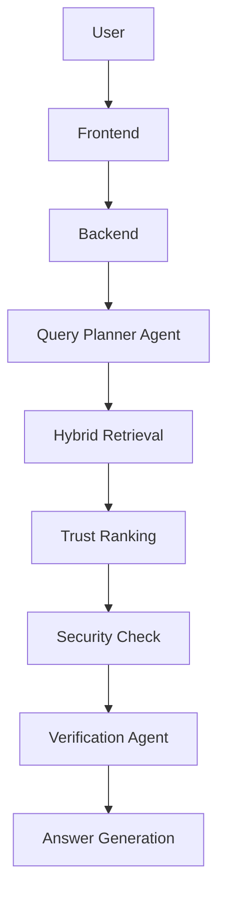

# Noviq

**Trust-Aware Multi-Agent AI Search Engine**

## Core capabilities
*   Hybrid search
*   Trust-aware ranking
*   Prompt injection defense
*   Multi-source verification
*   Explainable AI search

## Architecture



## Technology stack
*   Next.js
*   TypeScript
*   Tailwind
*   FastAPI
*   Python (3.13)
*   LangGraph
*   PostgreSQL
*   Qdrant
*   OpenSearch
*   Redis
*   Docker

## Local development

### 1. Start infrastructure
Run Docker compose to start databases and caching:
```bash
docker compose up -d
```
*Note: Ensure Docker Desktop is running.*

### 2. Start backend
Requires `uv` installed.
```bash
cd backend
uv run fastapi dev app/main.py
```

### 3. Start frontend
```bash
cd frontend
npm run dev
```

### 4. Verify health
The backend health check is available at: `http://localhost:8000/api/v1/health`

## Repository structure
*   `frontend/`: Next.js React frontend.
*   `backend/`: Python FastAPI backend.
*   `infrastructure/`: Docker and infrastructure configuration.
*   `docs/`: Architecture and decision documentation.

## Environment setup
Copy `.env.example` to `.env` and fill in the appropriate values. Do not commit `.env`.
